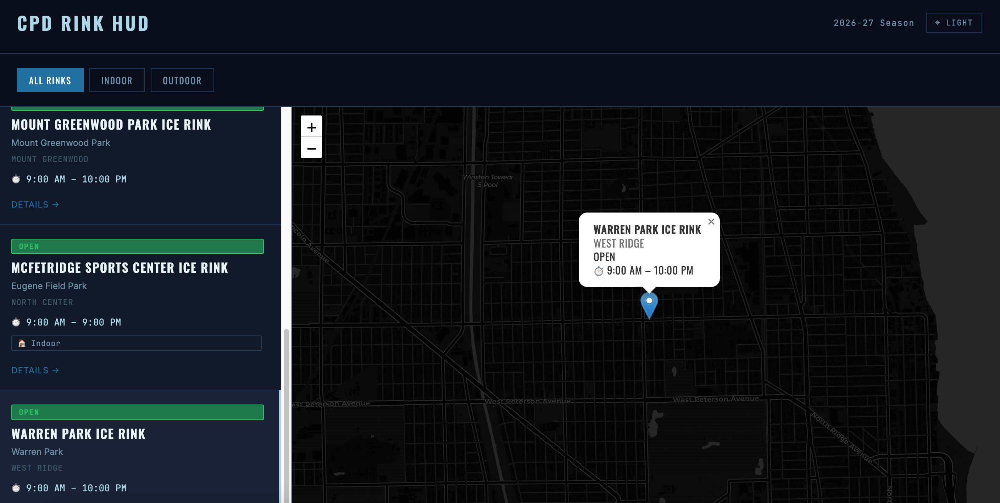

# CPD Rink HUD

A Chicago Park District ice rink directory and status board built with Craft CMS 5.

---

## What It Is

Live reference for all CPD ice rinks across Chicago neighborhoods.

Hours, programs, amenities, and seasonal status — all in one place.

---

## Features

- All Chicago Park District ice rinks in one place
- Open / Closed / Weather Hold / Maintenance status board
- Hours and program details per rink (Rat Hockey, Stick & Puck, Open Skate, etc.)
- Indoor vs. outdoor indicator
- Neighborhood browsing
- Interactive map with click-to-fly and hover info
- Dark / light mode HUD aesthetic

---

## Interactive Map

- Built with Leaflet.js
- Click any rink card to fly the map to its location
- Hover map pins for quick info (status, hours, neighborhood)
- Map tiles switch between dark/light to match the HUD theme

---

## Tech Stack

- CMS: Craft CMS 5
- Language: PHP 8.3
- Templating: Twig
- Database: MySQL 8
- Local Dev: MAMP
- Frontend: Vanilla CSS
- Mapping: Leaflet.js + CartoDB/OpenStreetMap tiles

---

## Data Source

Rink locations sourced from the City of Chicago Open Data Portal.

Hours and program details manually curated from chicagoparkdistrict.com.

---

## Local Setup

Requirements: PHP 8.2+, MySQL 8, Composer

git clone https://github.com/DKranzMAT/cpd-rink-hud.git

cd cpd-rink-hud

composer install

cp .env.example.dev .env

Update .env with your local DB credentials, then:

php craft install

---

## Project Structure

config/ — Craft config and Project Config YAML

templates/ — Twig templates

web/ — Docroot

---

## Status

Local development

---

Built by DKranzMAT
